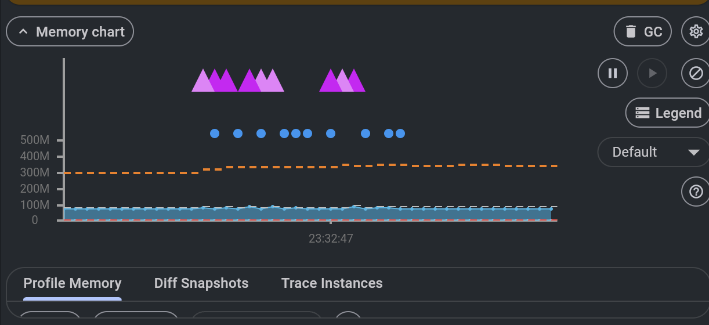
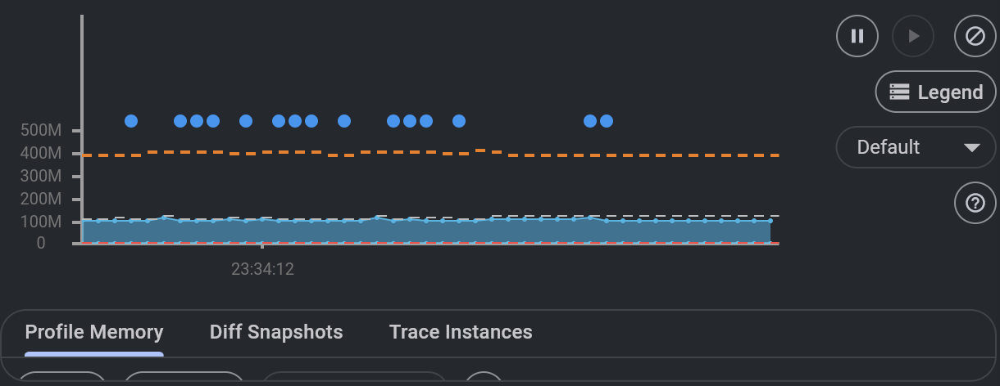

# Q1 — Flutter List Rendering Optimisation

## Overview
This folder contains two implementations of a Flutter screen displaying a vertically scrollable list of 1,000 network images (image + short text per item). Both use the same fixed public API: [Picsum Photos](https://picsum.photos/) (`https://picsum.photos/id/{index}/200/200`).

## Structure
- `naive/` — Non-optimised implementation (intentionally poor choices for comparison).
- `optimised/` — Production-ready implementation with best practices.

Run with FVM (Flutter 3.32.8). From repo root:

```bash
cd Q1/naive && fvm flutter run -d chrome   # or -d ios / -d android
cd Q1/optimised && fvm flutter run -d chrome
```

## Explanation

### Problems in Non-Optimised Version

The naive app uses two main anti-patterns that hurt performance and user experience.

**1. ListView with all children built up front**

The code uses `ListView(children: List.generate(1000, ...))`. That builds **all 1,000 list tiles and image widgets** as soon as the screen is displayed. Flutter has to create, layout, and attach every item to the tree even though only a dozen or so are visible. That leads to:

- **High memory use**: All 1,000 widgets and their state live in memory at once.
- **Slow first frame**: The first paint is delayed while the framework builds and lays out the full list.
- **Risk of jank on scroll**: Although only visible items are painted, the entire list is still in the tree; any layout or rebuild can touch many widgets.

**2. Image.network with no caching or loading state**

Each item uses `Image.network(url)` with no caching, placeholder, or error widget. That causes:

- **Repeated network requests**: Scrolling back to a previously seen image fetches it again from the network.
- **No loading feedback**: Users see blank or broken layout until each image loads.
- **No error handling**: Failed loads show nothing useful and can leave the list looking broken.
- **Unbounded image memory**: Without a cache policy, decoded bitmaps can pile up and increase memory pressure, especially when combined with 1,000 widgets.

Together, these choices make the naive list heavy on memory, slower to open, and more prone to scroll jank and poor behaviour on low-end devices or slow networks.

### Techniques Applied in the Optimised Version

| Technique | Why it helps |
|-----------|--------------|
| **ListView.builder** | Only builds widgets for items that are (or are about to be) visible. As the user scrolls, new items are created and off-screen items can be disposed. This keeps the widget tree small and reduces memory and layout cost. |
| **CachedNetworkImage** | Caches downloaded and decoded images in memory (and optionally on disk). Revisiting an item shows the image immediately without a new network request and avoids re-decoding. |
| **Placeholder & errorWidget** | Placeholder shows a loading indicator so the list doesn’t look empty; errorWidget shows a fallback icon on failure. Both improve perceived performance and robustness. |
| **RepaintBoundary per item** | Isolates each list item’s repaint. When one tile (e.g. an image) repaints, the boundary limits repaint to that tile instead of triggering repaints up the tree. Smoother scrolling. |
| **Fixed image dimensions (56×56)** | Width and height are set so the list doesn’t reflow when images load. Avoids layout thrash and keeps scroll position stable. |
| **Same image URL size (200×200)** | Requesting a fixed size from Picsum keeps response size and decode cost predictable instead of loading full-resolution images. |

### Profiling Data

Use Flutter DevTools to compare the two apps (timeline, memory, network).

**How to capture:**

1. Run the app in profile mode:  
   `fvm flutter run -d chrome --profile` (or `-d ios` / `-d android`).
2. Open DevTools (link printed in the terminal, or from your IDE).
3. **Performance / Timeline**: Record while scrolling the list; compare frame times (e.g. 16 ms for 60 FPS) and identify jank.
4. **Memory**: Take a heap snapshot after the list is fully built (naive) vs after scrolling through the list (optimised). Compare heap size and number of image-related objects. Reference screenshots below.
5. **Network**: Scroll up and down; in the naive app, repeated requests for the same URLs should appear; in the optimised app, repeat visits should hit cache.

**Memory DevTools screenshots**

DevTools → **Memory** → **Profile Memory** tab, with the list loaded (naive: all items built; optimised: after scrolling). Screenshots are in `images/`.

*Naive — Memory chart with list visible (all 1,000 items built, no image cache).*  
Blue shaded area shows live usage; purple markers indicate when the app is cleaning up unused memory (garbage collection). Higher memory use and more frequent cleanups are typical because every list item and image is kept in memory.



*Optimised — Memory chart after scrolling (lazy list + cached images).*  
Usage stays closer to baseline; fewer memory-cleanup spikes because only visible items and a bounded image cache are kept.



