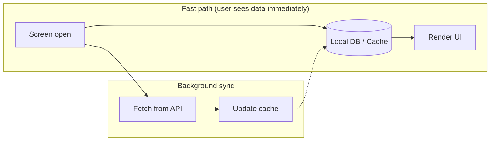

# Optimizing Flutter Applications for Low-End Devices

## Introduction
Getting an app to run well on a high-end phone isn’t hard. The real test is low-end devices: tight RAM, weaker CPUs, and OSes that kill memory-hungry apps quickly. If you want a smooth 60fps (or 120fps) there, you have to treat performance as part of the design from day one—not something you bolt on later. Below is a run-through of what actually works in practice: rendering, memory, network, build size, and how to find bottlenecks.

## 1. Rendering & UI: Taming the UI Thread
Flutter draws the UI by walking the widget tree, doing layout, then paint. Too many rebuilds and the UI thread blows past the 16ms-per-frame budget—you get jank. 

The biggest win is **cutting down rebuilds**. `const` constructors are the low-hanging fruit: Flutter can reuse the widget instance instead of rebuilding. Keeping state in smaller, focused widgets also helps so you don’t rebuild half the tree when one thing changes.

For animations and other heavy paint work, **RepaintBoundary** is your friend. It gives the child its own display list so that one animating widget doesn’t force the whole screen to repaint. In graphics-heavy apps, **shader warm-up** at startup is worth it—otherwise Skia/Impeller compiles shaders on first use and you get a visible hitch.

## 2. Memory Management: Avoiding Out-Of-Memory (OOM) Crashes
Low-end devices don’t hesitate to kill apps that use too much RAM. Images are usually the culprit—loading a 4K asset into a 100×100 avatar still decodes the full thing in memory. Use **image downsampling**: set `cacheWidth` / `cacheHeight` on `Image.network` or `CachedNetworkImage` so you only decode at the size you need.

When leaving image-heavy screens, clear **ImageCache** (or trim it) so you’re not holding onto bitmaps you don’t need. For long lists, **ListView.builder** / **GridView.builder** are the way to go—only build widgets for what’s on screen. Anything else is asking for trouble on 2GB devices.

Heavy work on the main thread (e.g. parsing a huge JSON blob) will stutter the UI. Push that into **Isolates**—`Isolate.run()` or `compute()`—so the UI thread stays responsive.

```dart
// Parse big JSON off the UI thread
Future<List<UserModel>> fetchUsers(String responseBody) async {
  return await Isolate.run(() {
    final parsed = jsonDecode(responseBody).cast<Map<String, dynamic>>();
    return parsed.map<UserModel>((json) => UserModel.fromJson(json)).toList();
  });
}
```

## 3. Network & Data: Designing for Throttled Connections
On low-end devices you often get slow or flaky networks too. Pulling huge lists in one go is heavy on memory and on the connection. **Pagination** (or infinite scroll with small page sizes, e.g. 20 items) on both backend and client keeps things manageable.

Smaller responses help: **GZIP** (or similar) and APIs that don’t send fields you don’t use.

The thing that really makes an app feel fast on bad networks is **offline-first**: keep data in a local DB (Isar, Hive, SQLite, etc.). On screen open you read from cache and paint immediately; in the background you hit the API and update the cache. User sees something right away; next time they open the screen they get fresher data.



*Same screen open: show cache first, then sync in the background and update cache for next time.*

## 4. Build & Compilation: Minimizing App Footprint
Smaller binaries load faster and use less memory at startup. Dart’s **tree-shaking** already strips unused code; the main thing is to avoid pulling in huge dependencies for one feature.

For bigger apps, **deferred loading** (code splitting) helps: ship the core first, load heavy bits (e.g. a heavy dashboard) when the user actually opens that flow. In release builds, **obfuscation** (`--obfuscate`) and `--split-debug-info` trim size and make the bundle a bit leaner.

## 5. Profiling & Tooling: Identifying Bottlenecks
If you’re not measuring, you’re guessing. **Don’t profile in Debug**—assertions and no JIT make it misleading. Use **Profile** mode on a real low-end device.

**Flutter DevTools** is where you track down jank. The **Performance Overlay** shows you frame drops on the UI and raster threads at a glance. When the UI thread is the problem, the CPU profiler shows which Dart code is eating time. For memory issues, take **heap snapshots** before and after a flow (e.g. open screen → do something → go back); look for stuff that should have been collected (e.g. controllers or tickers that are still referenced somewhere).

## Conclusion
None of this is silver-bullet stuff—you need less rebuilds, smaller images, chunked network and cache, a leaner build, and real profiling on real devices. Do that consistently and the app holds up on low-end hardware instead of feeling like it was built only for the latest flagship.

---
### Supporting Snippets

**Snippet 1: Image downsampling**
```dart
// Bad: Loads full resolution into memory
Image.network(imageUrl); 

// Good: Decodes only what is needed
Image.network(
  imageUrl,
  cacheWidth: 200, // Downsamples to 200px width
);
```

**Snippet 2: Const constructor**
```dart
// Bad: New instance on every rebuild
Text('Hello', style: TextStyle(fontSize: 16));

// Good: Flutter reuses the same instance
const Text('Hello', style: TextStyle(fontSize: 16));

// Also good: const widgets in a list
ListView(
  children: const [
    ListTile(title: Text('Item 1')),
    ListTile(title: Text('Item 2')),
  ],
);
```

**Snippet 3: Pagination (infinite scroll)**
```dart
// Fetch a page at a time; load more when user scrolls near the end
class ProductList extends StatefulWidget {
  @override
  State<ProductList> createState() => _ProductListState();
}

class _ProductListState extends State<ProductList> {
  final List<Product> _items = [];
  int _page = 0;
  static const int _pageSize = 20;
  bool _loading = false;
  bool _hasMore = true;

  @override
  void initState() {
    super.initState();
    _loadMore();
  }

  Future<void> _loadMore() async {
    if (_loading || !_hasMore) return;
    _loading = true;
    final newItems = await api.fetchProducts(page: _page, limit: _pageSize);
    setState(() {
      _items.addAll(newItems);
      _page++;
      _hasMore = newItems.length >= _pageSize;
      _loading = false;
    });
  }

  @override
  Widget build(BuildContext context) {
    return ListView.builder(
      itemCount: _items.length + (_hasMore ? 1 : 0),
      itemBuilder: (context, index) {
        if (index == _items.length) {
          _loadMore(); // Trigger next page when last item is visible
          return const Center(child: CircularProgressIndicator());
        }
        return ProductTile(product: _items[index]);
      },
    );
  }
}
```